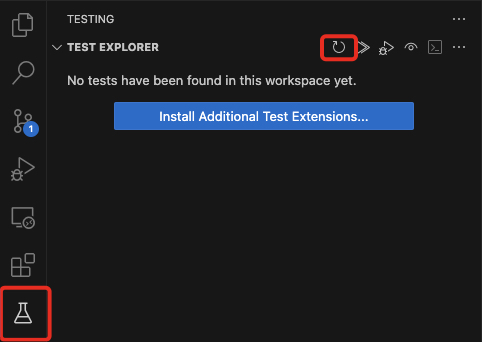

# bb-playwright-testing-template

A minimal, ready-to-use Playwright testing setup for easy cloning and use by the team.

## Getting Started

Check out our best practices at [Playwright - Best Practices & Examples](./docs/playwright/pw-best-practices-and-examples.md).

1. Install the dependencies

```bash
npm install
```

2. Open the Test tab, your tests should appear.

If your tests do not appear, use the 🔄 Refresh button:



## Environment variables

You want to define environment variables such as usernames and passwords in a `.env` file.

We've already included a base starting point for you at [`.env.example`](./.env.example).
Rename this to `.env`, edit the variables and your good to go!

> [!IMPORTANT]
> The `.env` file should included in .gitignore to prevent sharing sensitive information online

## Creating Tests

You can write tests in both `.ts` and `.js`.

### Setup Files

A `setup` is a script which **runs before** each project where it is declared as a `dependency`.

> **Example**
> If your app is secured with an authentication profile, the tester needs to be logged in before it can execute tasks in the application.
> Instead of recording the login process each time, you can create an `auth.setup.ts` in which you define the login process.

You can declare a setup as dependency for each project in `playwright.config.ts`.

Check this [`auth.setup.ts` example](./samples/auth.setup.ts) which runs a simple login task.

Read more official documentation: [Playwright - Global setup and teardown](https://playwright.dev/docs/test-global-setup-teardown)

## Running Tests

> [!NOTE]
> If you wish to test on a sandbox, enable `Public testing` in your sandbox configurations

You can run your tests via the terminal:

```bash
# This will open the Playwright Testing App
npm test
```

Or with the VSCode Playwright extension.

## 🔧 Utilities

This project provides a set of helper utilities to streamline common testing.

It includes helpers for:

- 🔐 Working with JWTs ([AuthHelper](/docs/utils/auth-helper.md))
- ⚙ Creating and managing configs ([Config](/docs/utils/config.md))
- 🗄️ Managing the file system and downloaded files ([Director](/docs/utils/director.md))
- 📄 Extracting and reading PDF files ([PdfHelper](/docs/utils/pdf-helper.md))

---

## 📁 File Structure

```bash
src
├── tests # Your tests go here
│   └── setup # Additional setup files go here
└── utils
    ├── auth
    ├── config
    ├── director
    └── pdf
```

---

## ⚙️ TypeScript Support (But You Can Still Write JavaScript!)

This project is written in **TypeScript (.ts)** to take advantage of static typing and modern tooling.

However, **you can still use plain JavaScript** if you prefer!

---
